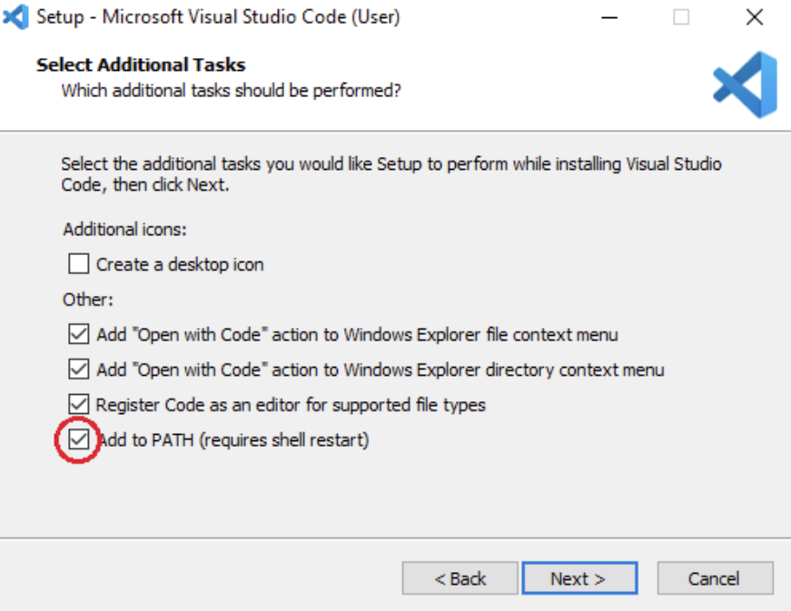
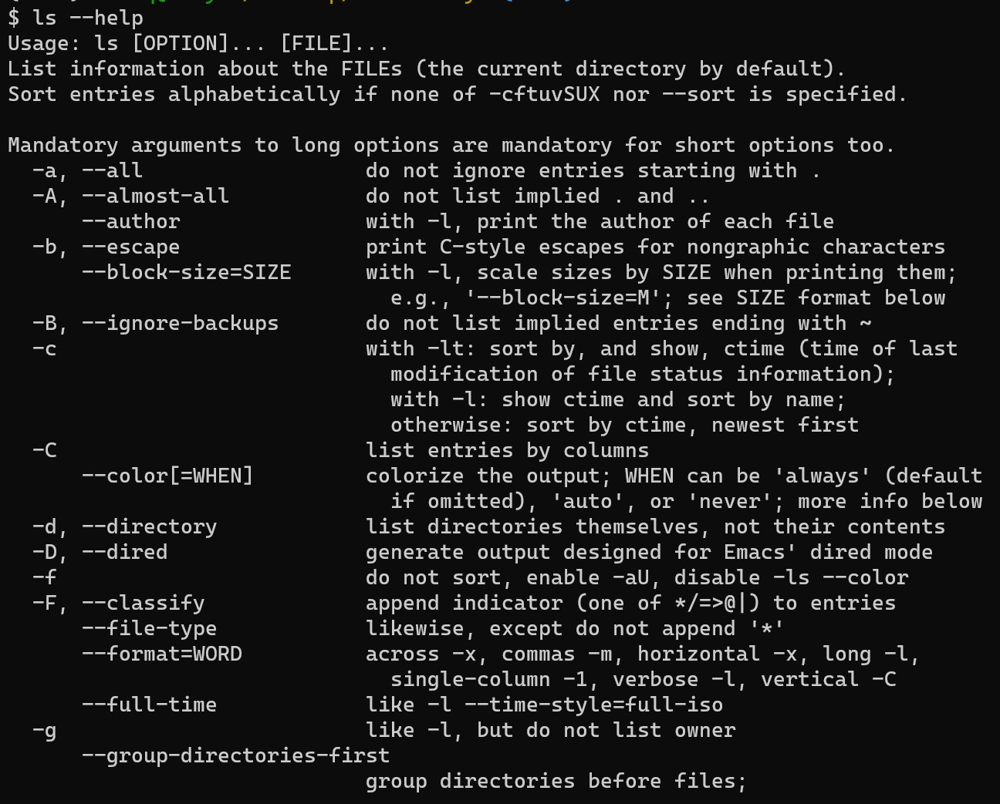
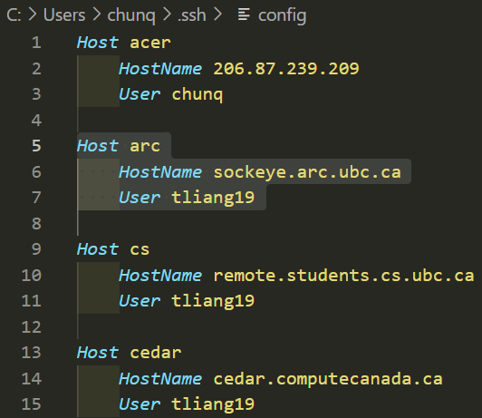
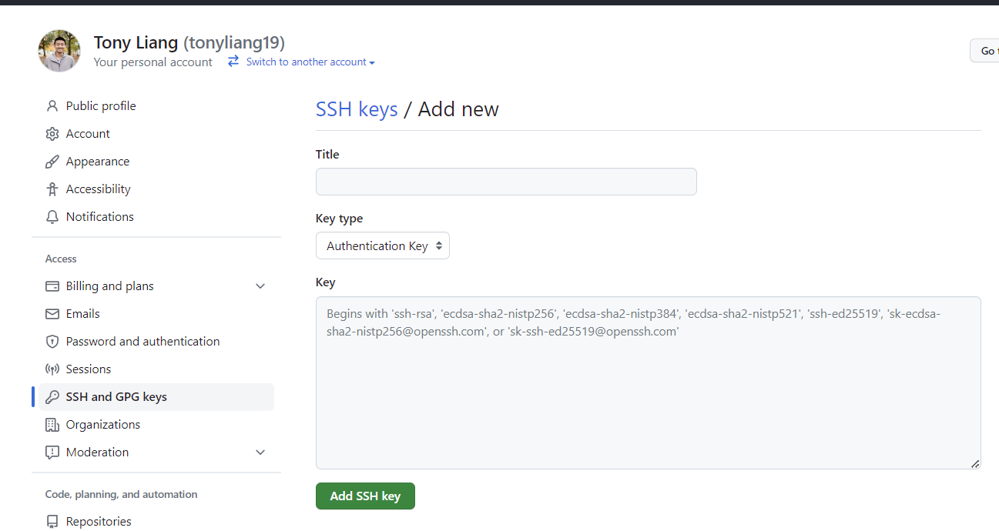
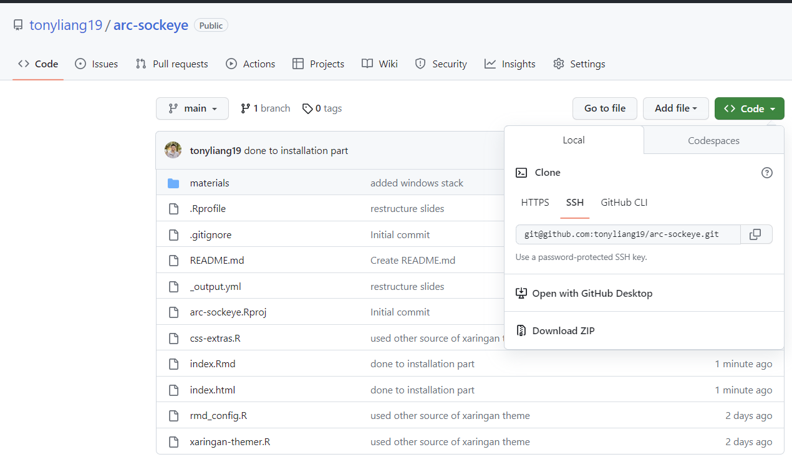
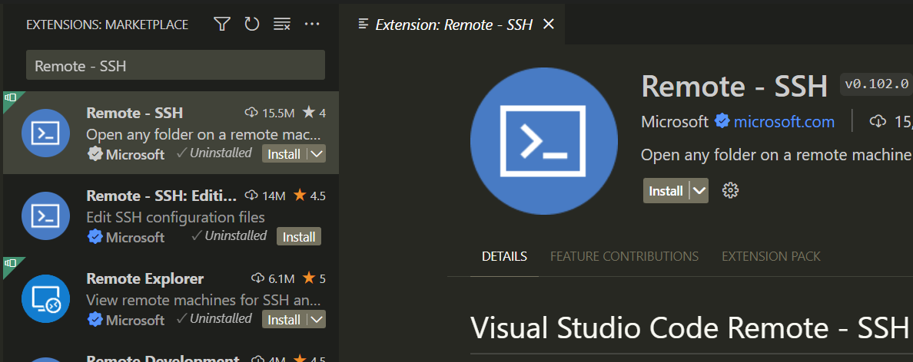
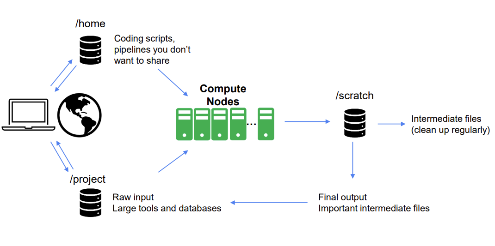
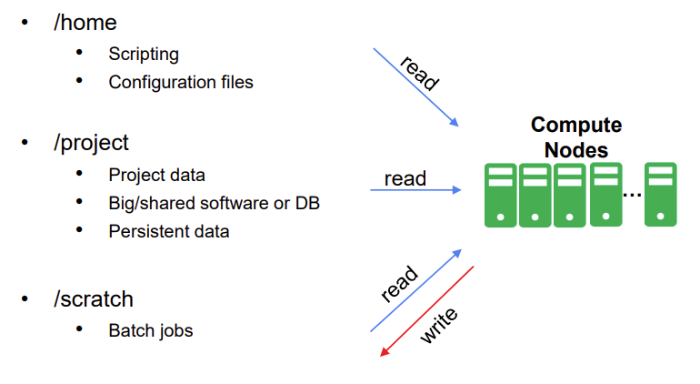
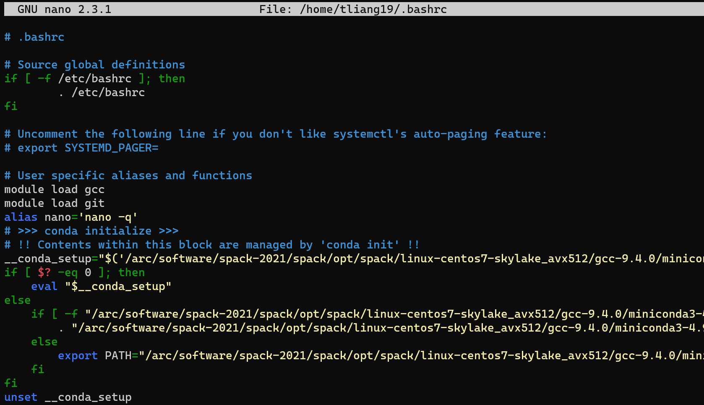
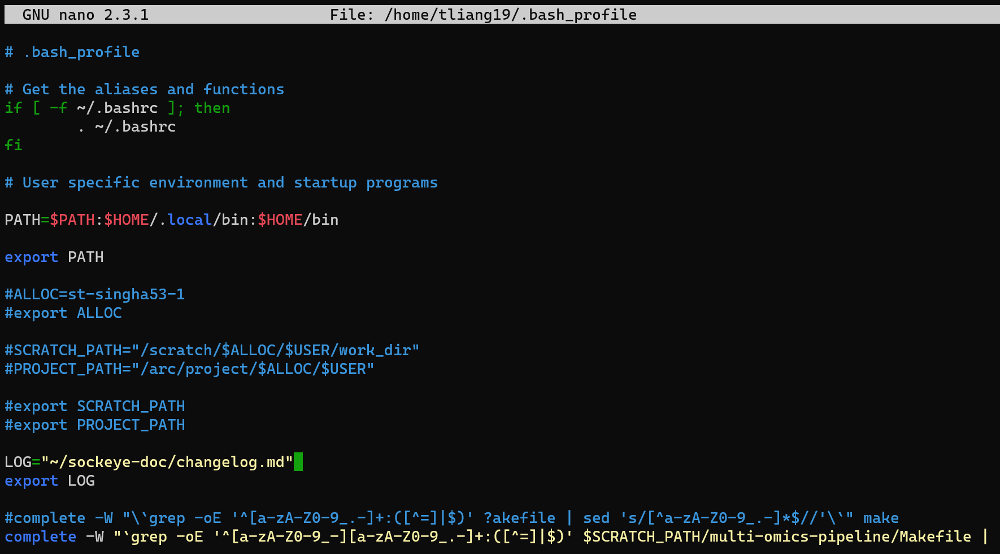

```{r setup, include=FALSE, echo=FALSE}
source("rmd_config.R")
library(DT)
library(sf)
library(knitr)
knitr::opts_chunk$set(eval=FALSE)
xaringanExtra::use_clipboard(
  button_text = "Copy",
  success_text = "Copied",
  error_text = "Press Ctrl + C to copy"
)
```

```{r css-extras, file="css-extras.R", echo=FALSE}
```

# Land acknowledgement

.pull-left[
**I would like to acknowledge that I work on the traditional, ancestral, and unceded territory of the Coast Salish Peoples, including the territories of the xwməθkwəy̓əm (Musqueam), Skwxwú7mesh (Squamish), Stó:lō and Səl̓ílwətaʔ/Selilwitulh (Tsleil- Waututh) Nations.**

*Traditional*: Traditionally used and/or occupied by Musqueam people

*Ancestral*: Recognizes land that is handed down from generation to generation

*Unceded*: Refers to land that was not turned over to the Crown (government) by a treaty or other agreement

]

.pull-right[
.center[]
]

---

class: top

## Topics

--

I'm being very extra to show what we are doing today **hopefully?**

.emphasis[
Prepare for the next 50 minutes, eat something, drink something, 

it's gonna be a heavy session.
]

--

.pull-left[
### Easy

- VS Code Setup

- Basic information of Sockeye

- Sockeye Login
]

--

.pull-right[
### Hard

- Linux and CLI

- Bashrc

- Job Submission
]

--

<br>

.secondary[About to start, make sure to follow along!]
.center[
`r pro`  .hand[FOLLOW ME]
`r con`  .hand[FOLLOW ME]
]

---

class: center, middle, inverse
.larger[.hand-blue[FOLLOW ME]]

---

## VS Code

Visual Studio Code (VS Code) is a code/text editor, IDE made by Microsoft. 

--

.pull-left[

.secondary[VS code]
`r pro` Plugins for many programming languages
`r pro` Easy learning curve
`r pro` Has a GUI (clickable)
`r pro` `r pro` `r pro` You could `ssh` and transmit files through it
`r con` Not available in all device, requires installation
]

--

.pull-right[
.secondary[Other editors like Nano/Emacs/Vi]
`r pro` Available in every Unix-liked sytem 
`r pro` Highly customizable
`r con` Almost to no language supports
`r con` Steep learning curve
`r con` No GUI (master your keyboard usage)
]

--

.emphasis[

Use whatever is provided to you, unless you have permission to make more from what's available.
]

.footnote[Credits to [DSCI310](https://ubc-dsci.github.io/dsci-310-student/)]

---

### Installation Mac

Open this **[link](https://code.visualstudio.com/sha/download?build=stable&os=darwin-universal)** and download.

Once download is finished: 
1. Open the downloaded `zip`

1. Move the extracted VS Code app from `Downloads` to `Applications` (Located to your left under `Favorites`)

1. Launch VS Code and open the `Command Palette` by `Cmd + Shift + P`

1. Type `shell command`

1. Select the option: **Install `code` command in PATH**

1. Restart your terminal and try entering: `code --version` to confirm successful installation

--

<hr>

Your output should be something like:
  ```
  1.74.3
  97dec172d3256f8ca4bfb2143f3f76b503ca0534
  arm64 # or x64 if you are intel chip
  ```
--

.secondary[If you were lost or it did not work for you, checkout this [site](https://ubc-dsci.github.io/dsci-310-student/install_stack_mac_arm.html) or this [site](https://code.visualstudio.com/docs/setup/mac)] 

.footnote[Credits to [DSCI310](https://ubc-dsci.github.io/dsci-310-student/)]


---

### Installation Windows

Open this **[link](https://code.visualstudio.com/sha/download?build=stable&os=win32-x64-user)** and download.

.pull-left[
Once download is finished, run the installer and accept all default configuration except:
 - **On Select Additional Tasks**
    + Add 'Open with Code action to Windows file context menu'
    
    + Add ‘Open with Code’ action to Windows directory context menu”
    
    + Register Code as an editor for supported file types
    
    + Add to PATH (should be selected by default)
]

.pull-right[

]

--

<br>
.secondary[If you were lost or it did not work for you, checkout this [site](https://ubc-dsci.github.io/dsci-310-student/install_stack_windows.html#visual-studio-code)]

.footnote[Credits to [DSCI310](https://ubc-dsci.github.io/dsci-310-student/)]

---

### Installation Linux

Open this **[link](https://code.visualstudio.com/download)** and find the right installer upon your platform Linux Debian based or Red-hat based.

Test that VS code is installed and can be opened from Terminal by restarting terminal and typing the following command:
`code --version`


.secondary[If you were lost or it did not work for you, checkout this [site](https://ubc-dsci.github.io/dsci-310-student/install_stack_ubuntu.html)]

.footnote[Credits to [DSCI310](https://ubc-dsci.github.io/dsci-310-student/)]

---

class: inverse, center, middle, hand-blue

.larger[Let's get to coding]


---

# Linux and CLI
.pull-left[
We will be using the .hand[famous] Linux system, where everything is going to be blacked out.

It is very cool once you are familiar at this.

`r pro` Command Line Interface (CLI)

`r con` Graphical User Interface (GUI)
]

.pull-right[
.secondary[Useful CL commands]
```bash
cd ~/path/to/dir/
cp ~/file/to/copy.md file/to/paste.md
cp -r ~/dir/to/copy/ dir/to/paste
ls -a # list all files (including hidden)
rm ~/file/to/delete.txt
```
]

--

.your-turn[
How do you delete a directory then?
]

--

.emphasis[
rm -r ~/dir/to/delete 
]

The `-r` flag means to be done recursively. Many linux commands have this flag, in the case of `rm`, it remove directories and their contents recursively.

---

# Linux and CLI

Note, there are cases that you want to delete directories where files are protected (like those of **git**)

Use the following with **CAUTION**:

--

.alert[
.large[`rm -rf ~/dir/to/delete/gone_is_gone`]
]

--

The `-f` flag tells to delete .hand[force] without confirmation. Be very careful on what are you deleting. 

You likely don't want to contact admin:
> You: Hey, I think I have deleted my $HOME directory
>
> Admin: .......
>

--

Don't .secondary[panic] either, you rarely can delete those directories.

---

# Linux and CLI

Most Linux commands have a built-in manual (man page) that serves as a quick guide to tell you what a command does. You could almost always type `command --help`.

Let's see an example
--

.pull-left[
```bash
ls --help
```

Seems scary right? I agree! `r pro`

But it gets better later, and let's dig more into its details. Look at the following:
.emphasis[
Usage: ls [OPTION] ... [FILE] ...
]

This part is where it tells you how you should use a command, what **possible** options it accepts

The [...] are .secondary[optional argument/s] and could be specified with the **flag** it takes. For example: `ls -a` or `ls --all` list **ALL** files of a directory.

]
.pull-right[

]

---

.your-turn[

Try on any commands of your interest and look at its doc with `--help`

]

--
You could combine flags as well

```bash
ls -alh
```
Single letter flags **can** be combined together, BUT whole words .secondary[cannot] 

```bash
ls --all --human-readable -l
```
--

`r pro` Order of argument doesn't matter
`r pro` Short options can be combined together
`r pro` Try --help on a command that you don't know how to use
`r con` Long options cannot be combined together
`r con` Use -f flag wisely

--

.secondary[.larger[.center[Questions?]]]

---

# How to connect

Login to sockeye with:
```bash
# replace cwl with your actual cwl
# sockeye dynamically select one of three possible "login" nodes
ssh cwl@sockeye.arc.ubc.ca
```
.pull-left[
- Upon login, you're on a `login` node
- You can run **short** interactive jobs there
- We will have an alias to do this later
- But requires some configuration on your laptop/PC
]
--
.pull-right[
.your-turn[
- Try `ssh --help` and see what it says?
]]


--

<hr>

You could also login to specific login node:
```bash
# one of login01, login02, login03
ssh cwl@login03.sockeye.arc.ubc.ca
```
--

I rarely use this one ^

--

.emphasis[

You need to have an IP address from UBC, either by connected to UBC Wifi or VPN

]


---

class: middle, center
background-image: url(materials/img/ssh-keys.png)
background-size: contain

???

Explain difference of private and public keys, and its usage

---

## Faster way to connect
.pull-left[
Configure ssh keys, store it in your local and arc.

`r pro` No more password typing, and could use shorter **alias** for multiple servers. (if applies to you)
`r con` .secondary[You still need the **2FA**].

]

.pull-right[
Prompt the following to check existing `ssh` keys with `id_*` format:
```bash
ls -a ~/.ssh/
```
]
--

<hr>

.pull-left[
Generate a new ssh key pair (`Bash`/`Zsh`/`Powershell`)
```bash
ssh-keygen -t rsa
```
- Follow the defaults by prompting `Enter`
- Passphrase not required, personal flavor

]

.pull-right[
Two keys generated:
- one .tertiary[public] (`id_*.pub`)
- one .secondary[private] (`id_*`)

.alert[Keep the **private** safe and for your use only]
]

--

<hr>
Add it to Sockeye

```bash
# Note we are using the public key
ssh-copy-id -i ~/.ssh/id_rsa.pub cwl@sockeye.arc.ubc.ca # replace cwl
```

???

This is the last time entering password to sockeye

---

class: middle

.pull-left[
Only fixed not having to enter password, but still have to type the full `username@host`.
- Looking into **alias**

- Need .secondary[configuration]


<br>
Use VScode or any text editor to create `~/.ssh/config`:
```bash
Host alias-you-like # I use arc
    HostName sockeye.arc.ubc.ca
    User cwl
```
- `Host` = `User@Hostname`

- Multiple configuration (multiple servers)

- More options available , look at [here](https://www.ssh.com/academy/ssh/config)
]

.pull-right[


]

--

Try now with your newly created alias
```bash
ssh arc # Again I used arc as the alias 
```

---

### Use SSH with GitHub

.pull-left[
Apply the following steps to verify your `SSH` key with **GitHub**

1. Go to this **[GitHub site](https://github.com/settings/ssh/new)**

1. Add a suitable .tertiary[title/name] for the key

1. Copy the content of your .secondary[public] key, `id_*.pub` created early into the textbox

1. Leave everything as it is and click `Add SSH key`
]

.pull-right[

]

<br>

--

.alert[
Careful and not paste your **private** key up
]

<!---
.pull-left[

]
---->

---

class: middle

#### SSH with VSCode

.pull-left[

1. Open you VScode by prompting `code `in terminal

1. Press `Ctrl + Shift + X `

1. Type `Remote - SSH` in the search bar

1. Open the first option and click `install`

  - It should be installed in a few seconds
]

.pull-right[


]


---

#### Optional: Scp files

To copy files around sockeye and your local, use the `scp` command

```bash
scp FROM:~/path/from TO:~/path/to
```
- The `FROM` and `TO` need to be specified, such that it represents IP address
- `WHERE`**:**`WHAT`, **Note** the **:** is required
- The **sockeye** server is fixed

```bash
# This means to download some_file from your $HOME
# in sockeye to your local desktop
scp cwl@sockeye.arc.ubc.ca:/home/cwl/some_file ~/Desktop
```

```bash
# This means to upload some_file from your local Desktop
# to your project dir on sockeye 
scp ~/Desktop/some_file cwl@sockeye.arc.ubca:/arc/project/cwl/some_file
```

--

Remember the alias earlier?
```bash
# This works as well, if you have configure the ssh properly
scp arc:/home/cwl/some_file ~/Desktop
```

---

class: middle, center
.center[.larger[.secondary[Questions?]]]


---

# Basic Information of Sockeye

**Sockeye** is a High Performance Computing (HPC) platform, use it to run .secondary[large] computational analysis or works here.

--

- It uses .secondary[PBS Pro], Compute Canada uses .secondary[Slurm]

- Although requires knowledge to **Linux and CLI**

- You have different **nodes** on Sockeye

--

.pull-left[

.secondary[Login Nodes]

- Where you land after `ssh`
- Has internet access
- You spend **MOST** time here
]

.pull-right[

.secondary[Compute Nodes]

- "You don't do much on here"
- Do **not** have internet access
- There's an interactive type of this

]

--

.emphasis[
  You could `echo $HOSTNAME` to verify if you are in a login node
]

.footnote[For more information, visit its official [documentation](https://confluence.it.ubc.ca/display/UARC/Quickstart+Guide#QuickstartGuide-SettingupyourComputer)]

---

class: middle, center
background-image: url(materials/img/arc-structure.jpg)
background-size: contain

???

Explain what each node is, and the workflow

---

```{r nodes-sockeye, eval=TRUE, echo=FALSE, message=FALSE}
df <- readr::read_csv("sockeye_nodes.csv")
DT::datatable(
  df,
  fillContainer = FALSE,
  options=list(pageLength=2,scrollX=TRUE)
)
```

.footnote[For more information, visit [here](https://confluence.it.ubc.ca/display/UARC/About+Sockeye)]

???

Explain nodes difference here, add footnote

---

## Directories on Sockeye
.pull-left[

]
.pull-right[

]
--

.pull-left[   

#### /home
- The place you land after `ssh`, equivalent to `~`
- Only the **$USER** has access


.emphasis[
Recommend storing these as **ENV** variables, more on this later.
]

]

.pull-right[
#### **/project**
- Store your data, containers here
- Do not store intermediate results here

#### **/scratch**
- Playground space, widely used in compute node
- Your intermediate results should be written here
- .secondary[Try not storing huge stuff here]

]

???

These are soft links of directories, its actual path is different, demo it

1. Copy/transfer input data to /arc/project/<alloc-code> 
2. Login to Sockeye and create/modify job script(s) in /scratch/<alloc-code>
3. Submit jobs that read input data from /arc/project/<alloc-code> and writes output to /scratch/<alloc-code>  (or $TMDIR)
4. Job completes successfully
5. Copy/transfer job output from /scratch/<alloc-code> to /arc/projects/<alloc-code> 
6. Interactively post-process and/or analyze results in /arc/project/<alloc-code>

---

Try on it and explore through actual coding!
--

1. First setup `ENV` variables,  .alert[This is only valid for current bash session]

  - we need to configure the `.bashrc` to make it    work all time. .secondary[Show you later]

  ```bash
  export ALLOC=st-singha53-1
  export SCRATCH_PATH=/scratch/$ALLOC/$USER
  export PROJECT_PATH=/arc/project/$ALLOC/$USER
  ```
--

1. Print these `PATH` variables out to get its path, and `cd` into them
  - You could name them differently later

  ```bash
  echo $SCRATCH_PATH && echo $PROJECT_PATH
  ```
  ```bash
  cd $SCRATCH_PATH && ls -a
  ```
  ```bash
  cd $PROJECT_PATH && ls -a
  ```
  - The `&&` is .secondary[AND ] operator in **shell**
--

1. This one is more sockeye-specific to check spaces allocated to you
  ```bash
  print_quota
  ```
  
---

class: middle, center
.secondary[.larger[.center[Questions?]]]

---

# Bashrc

- We mentioned earlier, that the `export ...` is only valid for the current bash session
- once you log-out, it's gone

--

<hr>

.pull-left[

- You need to add this to the `.bashrc` or `.bash_profile` located in the root path `~`
- These are places where you store configurations
]

.pull-right[

- `r pro` .primary[With suitable configs, Linux >> Mac >> Windows]
- `r con` .secondary[Without configs, Linux sucks]
- `r con` .secondary[It's HARD to setup the configs, it will get better]
]

--
.center[.pull-left[
  
]]
.center[.pull-right[
  
]]

---
class:top
.pull-left[
Append the following to your `.bashrc` or `bash_profile`

```bash
export ALLOC=st-singha53-1
export SCRATCH_PATH=/scratch/$ALLOC/$USER
export PROJECT_PATH=/arc/project/$ALLOC/$USER
```

- You could also load modules here
- I mostly use `git`, `gcc`

```bash
module load gcc
module load git
```
]
.pull-right[
To make it work you need either of:
- `source ~/.bashrc`
- `source ~/.bash_profile`
- .secondary[It'r required to "reactivate" the configs]
- It's what it does behind the scenes when you login

.emphasis[
The `source` is only required when you want update right away. Bash auto source everytime you start it. 
]
]


--
<hr>
**More advanced usage**
- You could make `alias` for long commands, or hard to remember ones
```bash
alias la='ls -a'
alias h='history' # Prints list of commands you entered
# do not delete / or prompt if deleting more than 3 files at a time 
alias rm='rm -I --preserve-root'
# confirmation 
alias mv='mv -i'
alias cp='cp -i'
```
--

.secondary[Sorry, enough shell, let's go back to business]

---

# Job Submission

---

class: middle, center
background-image: url(materials/img/website_bkg.png)
background-position: top
background-size: contain

<br><br>
.secondary[.center[.larger[Thanks!]]]

Slides created via the R package [**xaringan**](https://github.com/yihui/xaringan).

Credits to:

  [Stat 406 Lecture Slides @DJM](https://ubc-stat.github.io/stat-406/)

<br><br>

.secondary[.center[.larger[Questions?]]]
