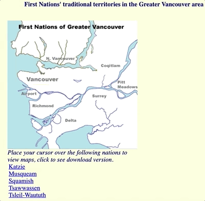

```{r setup, include=FALSE}
source("rmd_config.R")
```

```{r css-extras, file="css-extras.R", echo=FALSE}
```

# Land acknowledgement

.pull-left[
**I would like to acknowledge that I work on the traditional, ancestral, and unceded territory of the Coast Salish Peoples, including the territories of the xwməθkwəy̓əm (Musqueam), Skwxwú7mesh (Squamish), Stó:lō and Səl̓ílwətaʔ/Selilwitulh (Tsleil- Waututh) Nations.**

*Traditional*: Traditionally used and/or occupied by Musqueam people

*Ancestral*: Recognizes land that is handed down from generation to generation

*Unceded*: Refers to land that was not turned over to the Crown (government) by a treaty or other agreement

]

.pull-right[
.center[]
]

---

class: top

# Topics

--

I'm being very extra to show a `toc` of what we are doing today **hopefully**

.emphasis[Prepare for the next 50 minutes!]

--

.pull-left[
### Easy

- Basic information of Sockeye

- Sockeye Login
]

.pull-right[
### Hard

- Bashrc

- Job Submission
]

---

class: middle, center
background-image: url(materials/img/website_bkg.png)
background-position: top
background-size: contain

<br><br>
.secondary[.center[.larger[Thanks!]]]

Slides created via the R package [**xaringan**](https://github.com/yihui/xaringan).

Credits to:

  [Stat 406 Lecture Slides @DJM](https://ubc-stat.github.io/stat-406/)

<br><br>

.secondary[.center[.larger[Questions?]]]
